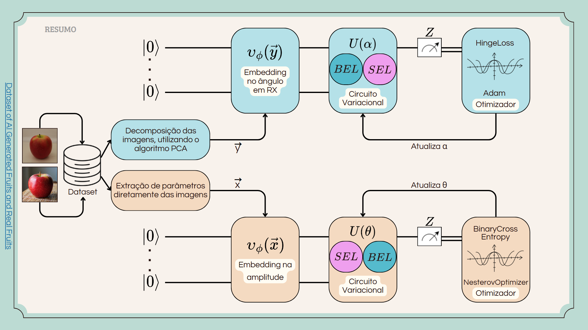

# Classificador Quântico Variacional: *imagens reais* x *geradas por IA*

## 📌 Motivações e Objetivos

&emsp; O projeto busca não apenas identificar qual técnica apresenta melhor desempenho, mas também explorar a viabilidade prática e a escalabilidade dos modelos quânticos em tarefas reais de classificação de imagens. Esta proposta pretende avançar o estado da arte na detecção de imagens geradas por IA, avaliando o potencial dessas novas tecnologias em aplicações críticas do mundo real.

## 📚 O que é o projeto?

&emsp; Este projeto propõe e compara duas abordagens distintas para a **detecção de imagens geradas por inteligência artificial (IA)** a partir de um **classificador quântico variacional**, com ênfase em imagens sintéticas criadas por modelos generativos como GANs (Redes Adversárias Generativas) e Diffusion Models. Essa iniciativa, parte em consequência da crescente dificuldade em distinguir imagens artificiais de reais, fator que levanta sérias preocupações em áreas como jornalismo, verificação de autenticidade, segurança digital e arte. Assim, este trabalho busca explorar soluções tecnológicas capazes de mitigar esse desafio emergente.

 O projeto se estrutura em duas arquiteturas principais:

### 📘 **Modelo V1** – Utiliza da *Principal Component Analysis* (PCA) e *Circuito Quântico variacional*

&emsp; Nesta abordagem, as imagens são pré-processadas e reduzidas em dimensão com o algoritmo **PCA (Principal Component Analysis)**, gerando vetores com um número menor de características representativas. Esses vetores são, então, utilizados como entrada em um circuito quântico variacional. O foco está na aplicação de embeddings angulares para a codificação dos dados em qubits, utilizando templates de entrelaçamento disponíveis no PennyLane. O objetivo é testar o potencial da computação quântica em um modelo focado em performace para tarefas de classificação binária.

 ### 📗 **Modelo V2** – *Extração de Parâmetros* e *Circuito Quântico Variacional*

&emsp; Nesta segunda abordagem, são extraídas manualmente características visuais das imagens, como entropia, cor, textura e componentes de Fourier. Posteriormente, os valores extraídos também podem ser utilizados como entrada em um circuito quântico variacional, permitindo a experimentação com diferentes estratégias de codificação (como embeddings em amplitude ou nos eixos RX, RY e RZ) e com várias combinações de camadas quânticas, para fins comparativos do modelo anterior em relação a outro modelo focado em escalabilidade.

> Ambas as abordagens utilizam validação cruzada, ajustes de funções de perda e diferentes otimizadores para construir classificadores binários robustos, capazes de distinguir com eficiência imagens reais de imagens artificiais.
